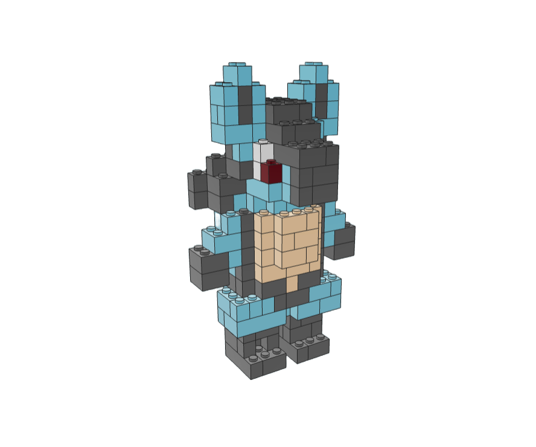
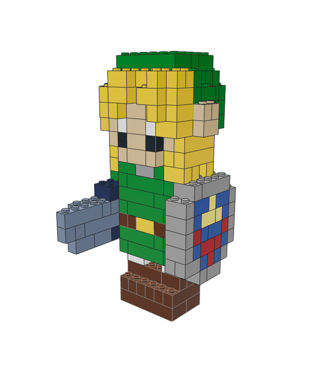
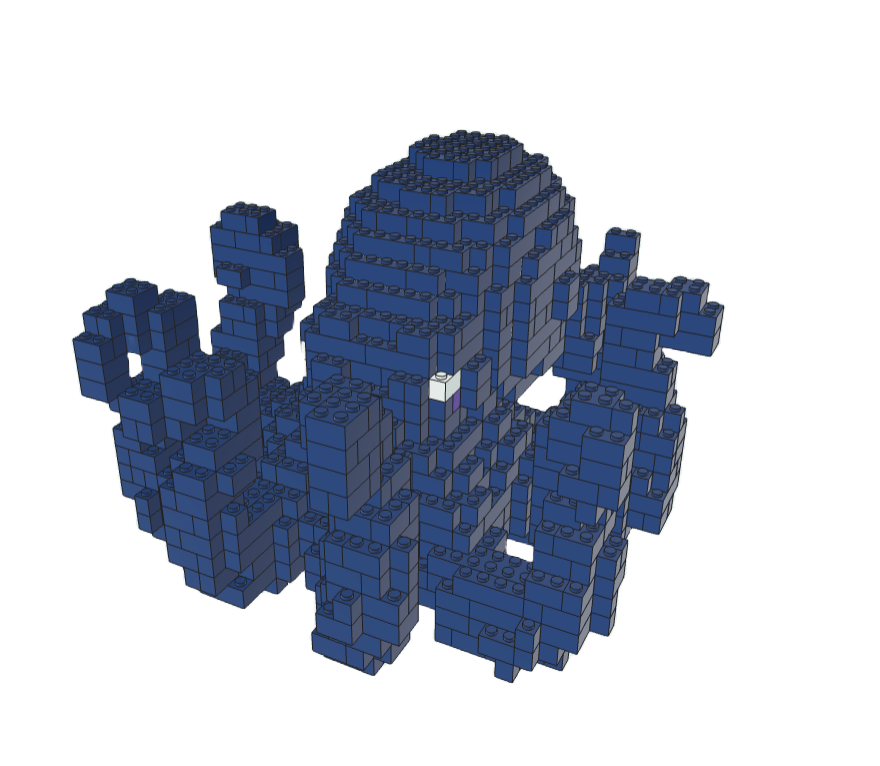

<h1 align="center">BrickBuilder</h1>

<p align="center">
  <b>Use AI to design LEGO® models.</b><br/> Turn any image or text prompt into a buildable LEGO®-compatible brick model.</b><br/>
  <!-- Get a 3D preview, step-by-step building instructions, downloadable LDR/MPD files, and a parts list you can order. -->
</p>

<p align="center">
  <a href="LICENSE"></a>
  <a href="https://github.com/jjohnson5253/brickbuilderai/stargazers"></a>
  <a href="https://github.com/jjohnson5253/brickbuilderai/network/members"></a>
  <a href="https://github.com/jjohnson5253/brickbuilderai/issues"></a>
  <a href="https://github.com/jjohnson5253/brickbuilderai/commits"></a>
  
  
</p>

<p align="center">
  
</p>

## What it does

Upload a photo or type a prompt, and BrickBuilder turns it into a real brick build:

1. **Image or text in** — start from any picture, or describe what you want.
2. **3D reconstruction** — a Trellis or SAM-3D model converts the subject into a solid shape.
3. **Voxelization** - 3D model is voxelized if using Trellis, or gotten directly from SAM3D stream
3. **Brick optimization** — an optimizer packs the voxels into real LEGO®-compatible parts.
4. **Build it** — explore the model in 3D, follow the instructions, download the LDR/MPD, or order the parts.

## Examples

<p align="center">
  
  
  
  
</p>

## Project layout

| Folder | What it is | Stack |
| --- | --- | --- |
| `frontend/` | Web app: upload, 3D viewer, instructions, checkout | React, Vite, TypeScript, Three.js, Tailwind, Supabase, Stripe |
| `backend/` | API that converts images/text into brick models | fal.ai Python, FastAPI, Open3D, Trimesh |
| `serverless/` | Image-to-3D voxel generation worker | SAM-3D, Docker, RunPod |

## Running locally

### Prerequisites

| Requirement | Notes |
| --- | --- |
| **Python 3.10+** | [python.org/downloads](https://www.python.org/downloads/) |
| **Node.js** | [nodejs.org](https://nodejs.org/) |
| **uv** | Python package manager — [install guide](https://docs.astral.sh/uv/getting-started/installation/) |
| **fal.ai account** | Sign up at [fal.ai](https://fal.ai/) and get an API key |

### Environment setup

1. Copy the example env files:
   ```bash
   cp backend/.env-example backend/.env
   cp frontend/.env-example frontend/.env
   ```

2. Set your fal API key in `backend/.env`:
   ```
   FAL_KEY=your_fal_api_key_here
   ```

3. (Optional) Configure Supabase, Stripe, and other integrations in the `.env` files as needed. A local postgres database will be spun up if supabase is not connected.

### Install & run

```bash
python install.py
python run.py
```
Voxelization with SAM-3D produces better results than Trellis, but it runs as a separate worker that you host on RunPod. To enable it, deploy the SAM-3D image on [RunPod](https://www.runpod.io/)

The SAM3D worker image is published publicly on Docker Hub as `jjohnson5253/manifold-sam3d:latest`, so you can deploy it on RunPod without building it yourself:

1. In the [RunPod Serverless console](https://www.runpod.io/console/serverless), create a new endpoint.
2. Set the container image to `jjohnson5253/manifold-sam3d:latest` (leave container registry auth blank — the image is public).
3. Pick a GPU with enough VRAM (an H100 is recommended for SAM-3D).
4. Attach a network volume to the endpoint and mount it where the model weights are cached. The weights are large, so the volume keeps them warm across workers and avoids re-downloading them on every cold start, which makes the endpoint load much faster.
5. Deploy, then copy the endpoint ID and your RunPod API key into `RUNPOD_ENDPOINT_ID` and `RUNPOD_API_KEY` in `backend/.env`.

See `serverless/README.md` if you want to build and push your own image instead.

## Attributes
- Voxelization: https://github.com/eisenwave/obj2voxel
- Legolization: https://github.com/AvaLovelace1/BrickGPT/
- image-to-3D streaming: https://github.com/rehan-remade/Manifold

## License

This project is licensed under the [MIT License](LICENSE).

> LEGO® is a trademark of the LEGO Group, which does not sponsor, authorize, or endorse this project.
