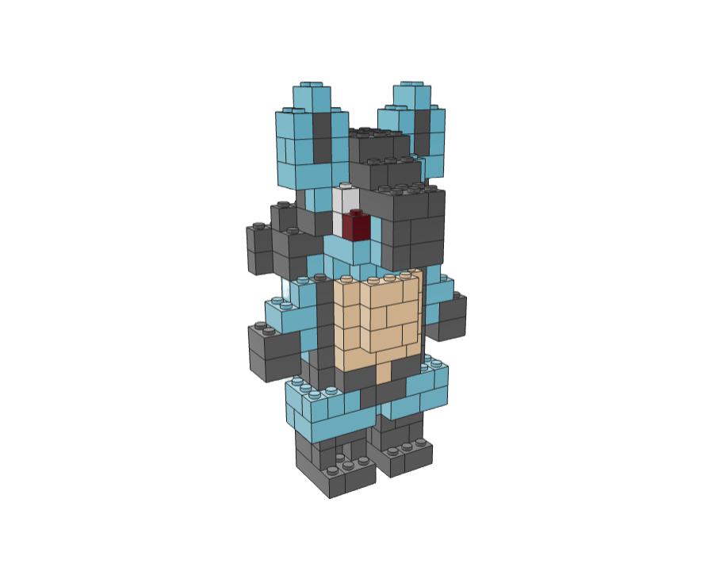
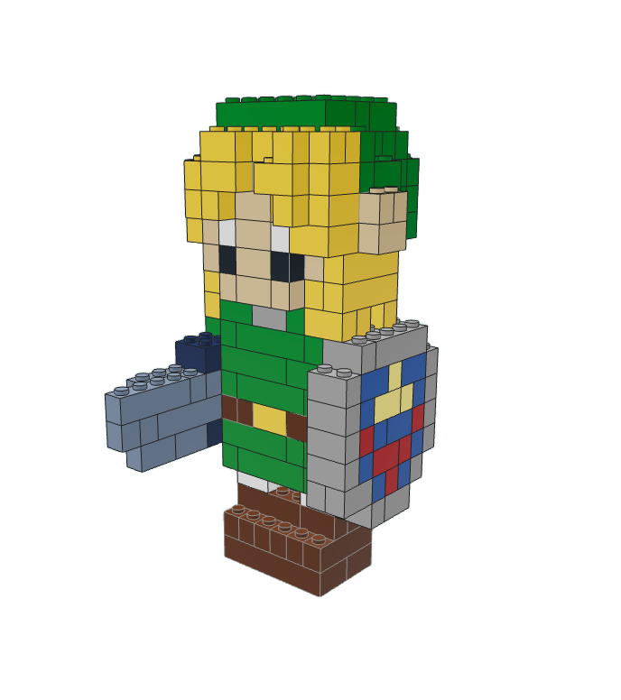
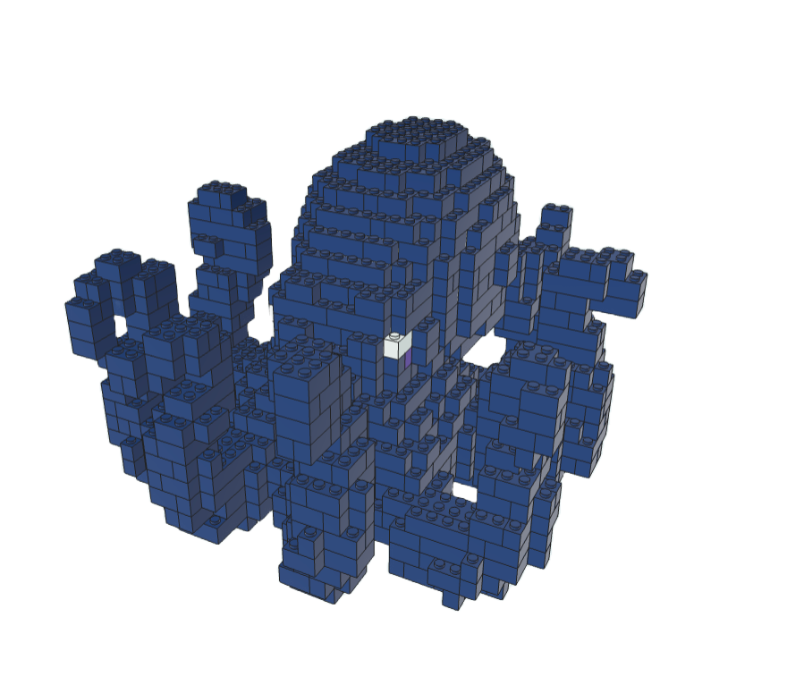

<h1 align="center">BrickBuilder</h1>

<p align="center">
  <strong>Turn an image or an idea into a buildable brick model.</strong><br>
  Generate a 3D model, inspect it in the browser, follow building instructions,
  and download files or a parts list.
</p>

<p align="center">
  <a href="LICENSE"></a>
  <a href="https://github.com/jjohnson5253/brickbuilderai/stargazers"></a>
  <a href="https://github.com/jjohnson5253/brickbuilderai/issues"></a>
</p>

<p align="center">
  
</p>

## How it works

1. **Describe or upload** — provide a text prompt or an image.
2. **Create geometry** — the backend uses the selected image-to-3D pipeline.
3. **Convert to bricks** — the model is voxelized and optimized into brick parts.
4. **Build and share** — view the result in 3D, step through instructions, download
   LDraw files (`.ldr`/`.mpd`), or review the parts list.

Standard generation uses the Trellis pipeline. SAM-3D is an optional streaming
pipeline that can produce better voxel results and typically completes in under
30 seconds, but requires a separately hosted RunPod worker.

## Examples

<p align="center">
  
  
  
  
</p>

## Repository layout

| Directory | Description |
| --- | --- |
| [`frontend/`](frontend/) | React/Vite application, 3D viewer, instructions, and checkout |
| [`backend/`](backend/) | FastAPI API, voxelization, brick optimization, and integrations |
| [`serverless/`](serverless/) | Dockerized SAM-3D worker for RunPod |

## Run locally

### Prerequisites

- Python 3.10 or newer
- Node.js and npm
- [uv](https://docs.astral.sh/uv/getting-started/installation/)
- A [fal.ai](https://fal.ai/) account and API key

### Configure environment variables

Copy the example files and fill in the values needed for your setup:

```bash
cp backend/.env-example backend/.env
cp frontend/.env-example frontend/.env
```

At minimum, set `FAL_KEY` in `backend/.env`. The frontend's local API mode
defaults to `http://127.0.0.1:8002`; set the Supabase values in
`frontend/.env` if you are using authentication or saved generations. See the
comments in both example files for optional integrations such as Stripe,
BrickOwl, PostHog, and RunPod.

> Never commit `.env` files or put server-only secrets in `VITE_*` variables.
> `VITE_*` values are bundled into the browser and are public.

### Install and start

From the repository root:

```bash
python install.py
python run.py
```

This starts the FastAPI backend on port `8002` and the Vite development server
on its configured local port. To run either application independently, see
[`backend/README.md`](backend/README.md) and
[`frontend/README.md`](frontend/README.md).

### Optional SAM-3D worker

The default pipeline does not require RunPod. To enable streaming generation,
deploy the public `jjohnson5253/manifold-sam3d:latest` image as a RunPod
Serverless endpoint, then set `RUNPOD_API_KEY` and `RUNPOD_ENDPOINT_ID` in
`backend/.env`. An H100 is recommended because the model requires substantial
GPU memory. For instructions to build the image yourself, see
[`serverless/README.md`](serverless/README.md).

## Testing

Dependencies are mocked where possible, so production credentials are not
needed for the test suites.

```bash
# Backend
cd backend
uv run --group dev pytest

# Frontend
cd frontend
npm install
npm test
```

## Related documentation

- [Backend API examples](backend/README.md)
- [Frontend development notes](frontend/README.md)
- [SAM-3D worker notes](serverless/README.md)

## Acknowledgements

- [BrickGPT](https://github.com/AvaLovelace1/BrickGPT/) — brick optimization
- [Manifold](https://github.com/rehan-remade/Manifold) — image-to-3D streaming

## License

BrickBuilder is licensed under the [MIT License](LICENSE).

> LEGO® is a trademark of the LEGO Group, which does not sponsor, authorize,
> or endorse this project.
